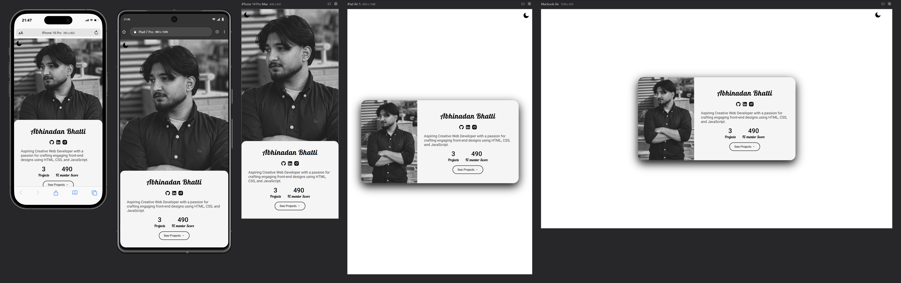

# 🪄 Interactive Profile Section

A responsive, theme‑switching profile card built with **HTML, CSS (custom properties, Grid/Flexbox)** and **Vanilla JavaScript**.
It’s the very first mini‑project in my “Creative Web Dev Journey” and is designed to demonstrate clean layout skills, basic DOM interactivity, and light/dark theming.



---

## ✨ Features

| Feature                             | Description                                                             |
| ----------------------------------- | ----------------------------------------------------------------------- |
| **Responsive layout**               | Mobile‑first card that expands into a two‑column desktop design         |
| **Light / Dark mode**               | One‑click theme toggle powered by CSS custom properties                 |
| **Expandable bio**                  | “More About Me” button reveals extra information without page reload    |
| **Social links with hover glow**    | GitHub, Instagram, and LinkedIn icons animate on hover                  |
| **Scroll‑friendly project gallery** | Mini project boxes inside the card scroll vertically on smaller screens |

---

## 🚀 Live Demo

> **COMING SOON** – Deployed link (Netlify / Vercel).
> For now, clone and run locally.

---

## 🛠️ Tech Stack

* **HTML5** – semantic markup
* **CSS3** – custom property theme system, Flexbox & Grid, media queries
* **JavaScript (ES6)** – DOM queries, class toggling, event listeners
* **Fonts & Icons** – Google Fonts / Remix Icon CDN

---

## 🔧 Local Development

1. **Clone the repo**

   ```bash
   git clone https://github.com/abhi-zero/dev-journey.git
   cd dev-journey/mini-projects/Interactive\ Profile\ Section
   ```

2. **Open `index.html`**

   Any live‑reload server works:

   ```bash
   # with VS Code Live Server extension  
   code .
   ```

3. **Play with it**

   * Edit `style.css` to tweak colors or spacing
   * Swap the two background images (`profilebw.jpg`) for your own
   * Add new project boxes inside the `.projects` container

---

## 📁 Project Structure

```
Interactive Profile Section/
├── index.html          # markup
├── style.css           # styles & themes
├── script.js           # JS interactivity
├── profilebw.jpg       # header/profile background
└── README.md           # ← you are here
```

---

## 🗜️ What I Learnt

* Setting up a **CSS custom‑property dark‑mode** system
* Using **Flexbox/Grid hybrids** for adaptive layouts
* Attaching multiple **click events** for UI toggles
* Small animation tricks (hover‑color swap, icon padding)

---

## 💡 Future Improvements

* Replace hard‑coded project boxes with dynamic data (JSON)
* Add a11y improvements (prefers‑color‑scheme, ARIA labels)

---

## 📜 License

MIT © 2025 Abhinandan Bhatti
