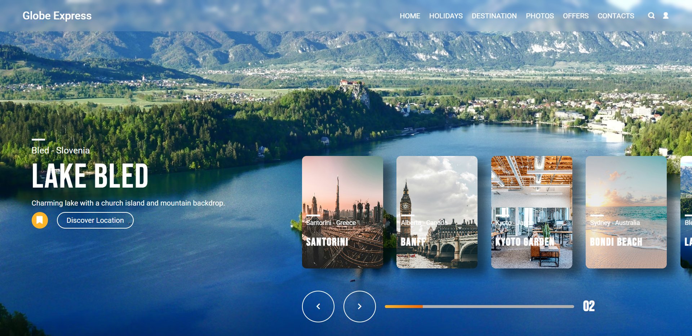

# 🌍 Globe Express – Image Slider

A visually engaging image slider showcasing beautiful travel destinations from around the world. Built with **HTML**, **CSS**, and **JavaScript**, this project demonstrates dynamic UI updates, smooth transitions, and responsive navigation for an immersive user experience.

---

## ✨ Features

- **Dynamic Image Cards:** Loads location data from JSON and displays interactive cards.
- **Auto-Scrolling Slider:** Images automatically transition every few seconds.
- **Manual Navigation:** Left/right arrow buttons allow users to browse at their own pace.
- **Progress Indicator:** Shows current image number and progress bar.
- **Responsive Design:** Adapts layout for desktop and mobile screens.
- **Mobile Navigation:** Hamburger menu for easy access on smaller devices.

---

## 🚀 Demo


> **Live Preview:** _Coming Soon!_

To run locally:

```bash
git clone https://github.com/abhi-zero/dev-journey.git
cd mini-projects/image-slider
open index.html # Or use VS Code Live Server
```

---

## 🛠️ Tech Stack

- **HTML5** – Semantic markup
- **CSS3** – Custom fonts, grid/flex layouts, transitions
- **JavaScript (ES6)** – DOM manipulation, event handling, fetch API

---

## 📁 Project Structure

```
image-slider/
├── index.html         # Main HTML file
├── style.css          # Styles and responsive rules
├── main.js            # Image slider logic
├── nav.js             # Mobile navigation handler
├── assets/
│   ├── data/
│   │   └── location.json   # Location/image data
│   ├── fonts/
│   └── images/
└── README.md          # ← This file
```

---

## 🔍 How It Works

- **Data Loading:** Fetches location data from `assets/data/location.json`.
- **Card Generation:** Dynamically creates image cards for each location.
- **Slider Animation:** Uses JavaScript to animate card transitions and update background info.
- **Navigation:** Handles both auto-scroll and manual arrow navigation, with progress feedback.

---

## 💡 Customization

- Add new locations by editing `assets/data/location.json`.
- Change fonts or colors in `style.css`.
- Adjust slider timing in [`main.js`](main.js) (`cardsAnimation` interval).

---

## 🗜️ What I Learned

- Modularizing UI logic for maintainable code.
- Using CSS grid/flex for responsive layouts.
- Handling asynchronous data and DOM updates.
- Creating smooth transitions and interactive navigation.

---

## 🖼️ Inspiration

This project was inspired by a design found on [Pinterest](https://in.pinterest.com/pin/663014376433312582/). Credit to the original creator for the visual concept.

---

## 📜 License

MIT © 2025 Abhinandan Bhatti