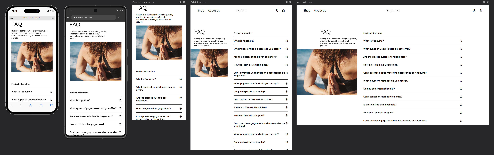

# 📂 Accordion + Modal UI Components – Mini Project

This project showcases two essential UI components built with HTML, CSS, and JavaScript: a **collapsible Accordion** and a **responsive Modal popup**. Both are part of my Phase 1 learning in the "Creative Web Dev Journey".


---

## ✨ Features

| Component     | Features                                                                                                                    |
| ------------- | --------------------------------------------------------------------------------------------------------------------------- |
| **Accordion** | Expand/Collapse answers on click <br> Smooth transitions, <br> accessible HTML structure |
| **Modal**     | Open on button click <br> Close on outside click or 'X' <br> Fade/scale animation <br> Overlay dim background               |

---

## 🖥️ Demo

[Live site link](https://faq-modalpage.netlify.app/)

To preview locally:

```bash
git clone https://github.com/abhi-zero/dev-journey.git
cd mini-projects/interactive-ui-components/accordion
open index.html # or use Live Server in VS Code
```

---

## 🛠️ Tech Used

* **HTML5** – semantic structure for accessibility
* **CSS3** – Flexbox, spacing, transitions, animations
* **JavaScript (ES6)** – modular JS (`accord.js`, `modal.js`, `nav.js`)

---

## 🔍 Project Structure

```
accordion/
├── index.html        # Markup for accordion & modal
├── style.css         # Shared styles & transitions
├── accord.js         # Accordion logic
├── modal.js          # Modal open/close handlers
├── nav.js            # Navigation toggle logic
├── assets/           # Icons or images (optional)
└── README.md         # ← This file
```

---

## 📚 What I Learned

* How to modularize JavaScript for UI features
* DOM selection with `querySelectorAll`
* Using `classList.toggle()` and `add/remove`
* Handling click events and backdrop overlays

---

## 🔧 Future Improvements

* Rotate arrow icons dynamically in accordion
* Add `Escape` key listener to close modal
* Add accessibility roles (aria-expanded, aria-hidden)
* Improve responsive spacing for smaller screens

---

## 📜 License

MIT © 2025 Abhinandan Bhatti
